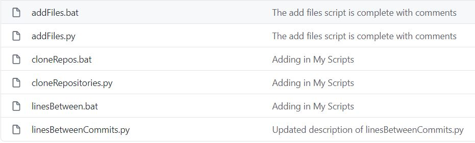

# GradingScripts
Welcome to the GradingScripts, home of all the scripts needed to grade the class SWEN-123!

Here is a brief guide for how to use the grading scripts for CSEC/SWEN-123. In this quick guide, I’ll be going over how to use these scripts, each of there purposes, and how to use them for the first time. If you’re not a CA for CSEC/SWEN-123, please stop reading. Or don’t. Not like this will be a very entertaining read.

