# GradingScripts
Welcome to the GradingScripts, home of all the scripts needed to grade the class SWEN-123!

&nbsp;&nbsp;&nbsp;&nbsp;&nbsp;Here is a brief guide for how to use the grading scripts for CSEC/SWEN-123. In this quick guide, I’ll be going over how to use these scripts, each of there purposes, and how to use them for the first time. If you’re not a CA for CSEC/SWEN-123, please stop reading. Or don’t. Not like this will be a very entertaining read.

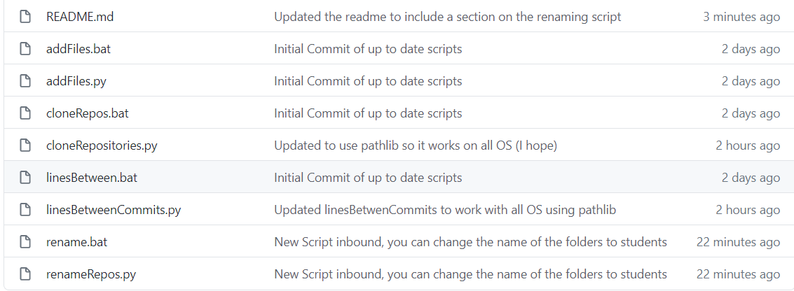

&nbsp;&nbsp;&nbsp;&nbsp;&nbsp;Before we get started with other things, let’s make sure you have installed what you need to actually run the scripts. In order to make life easier, we’re going to first start out with a tool called pip. If you installed Python, pip should already be on your computer, but in case it isn’t, go to this link and follow the instructions: https://pip.pypa.io/en/stable/installing/. It’s ok. I’ll wait for you to get back.

&nbsp;&nbsp;&nbsp;&nbsp;&nbsp;By now you should have pip (yay!). That means you’re on your way to being able to run the scripts at all! Now the next step is really easy. Now that you have pip, you just need to use it to install 3 packages that the scripts require. Those commands are as follows:

>pip install gitpython

>pip install PyGithub

>pip install pygithub3

&nbsp;&nbsp;&nbsp;&nbsp;&nbsp;Now that you have all the packages installed you can now run the scripts, huzzah! But wait, what’s this information you need? It doesn’t just work? Blasphemy!

&nbsp;&nbsp;&nbsp;&nbsp;&nbsp;Well, that’s what we’re going over next, what you should have access to for grading. We have 4 main scripts, each of which also includes a .bat file that can be used to run the script. There’s one file not listed here, called temp.txt. This text file will be created upon using any of these scripts for the first time and is used for storing information that should be consistent across the semester, primarily your Github Authentication token and the Github Organization name.

&nbsp;&nbsp;&nbsp;&nbsp;&nbsp;You’re probably thinking, “What’s a Github Authentication token?”. Basically it’s a token generated by Github that can be used to login to your Github account through the scripts. Needless to say, if you plan on using these scripts, you need to make a token. So let’s go over that now.

Steps | Guiding Images
:-----: | :-----------:
Log into your Github account | 
Go to the upper right-hand corner of the screen, click on the icon with your profile picture, and then on the settings. | 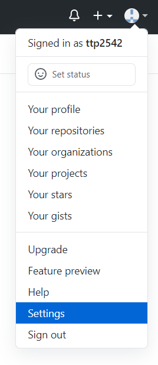
Click on the “Developer Settings” button at the bottom left. | 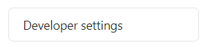
Click on the “Personal access tokens” button. | 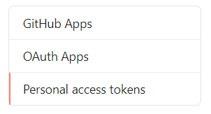
Click on the “Generate new token” icon in the top right of the screen (you may be prompted to log in again upon clicking this). | 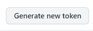
Add a Note so you know what the token is being used for and give it the “repo” and “read:packages” permissions. | 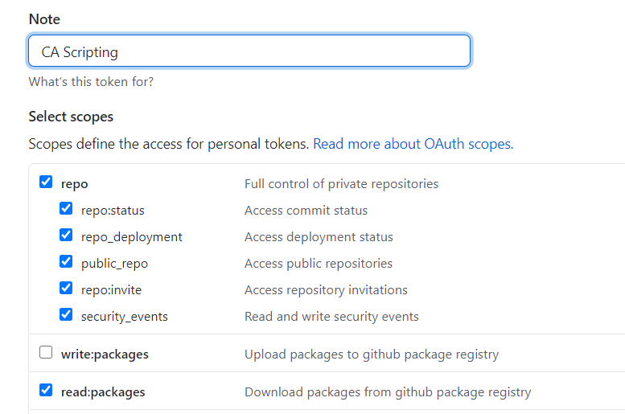
Scroll to the bottom and click the “Generate token” button. | 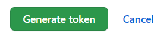
Copy this new token and put it somewhere safe (or put it into the script directly). NOTE: This will be stored in a file called temp.txt in the same location as the scripts. | 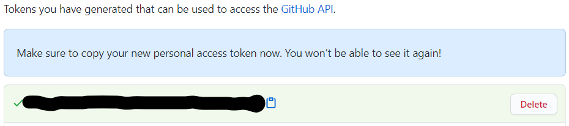

&nbsp;&nbsp;&nbsp;&nbsp;&nbsp;Some extra information about these tokens, you won’t be able to see them again after you get out of the page, so paste it in another file, or to where the script prompts you. The script will store it so you only have to do this once. However, if you delete the token on Github, the token will be rejected and you’ll need to delete or edit the temp.txt file in order to be able to use them again. You’ll probably crash the script if you try to use an invalid token, haven’t tried it personally.

&nbsp;&nbsp;&nbsp;&nbsp;&nbsp;The next thing you’ll need to do is get the organization name from Github. This is relatively easy compared to making a personal access token. Once you’re added to the organization, you should be able to access it on the left of the Github homepage.

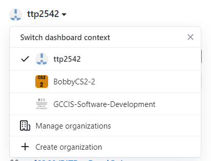

&nbsp;&nbsp;&nbsp;&nbsp;&nbsp;In order to ensure you spell it right, it’s recommended you click on the organization and copy the organization name from the link at the top of your browser, and then enter it into the script when prompted.

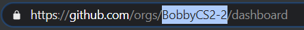

Now let’s run through using each script beyond the first 2 prompts.

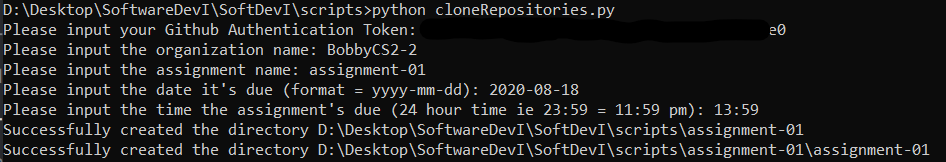

&nbsp;&nbsp;&nbsp;&nbsp;&nbsp;This is a typical first running of the cloneRepositories script. You put in your Github auth token and the organization name first. Beyond that, you need to enter the assignment name. This can be found on the left-hand side of the organization.

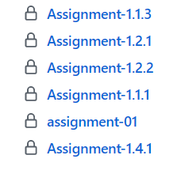

&nbsp;&nbsp;&nbsp;&nbsp;&nbsp;Next, you enter the day that it’s due in the proper format (‘yyyy-mm-dd’, ex: 2020-08-18). After that the time that the assignment is due (so it only gets the commits before that time) in 24 hour format (ex: ‘23:59’ for 11:59pm). The final prompt you'll be getting will be asking you about if you want to name a text file of student Github usernames. Entirely optional, but if you decide to make one, just enter the name of the file here. This will limit the amount repos you clone to just that list (so if you need to grade a specific person for a specific time, or if you only grade one half of a section, you can do this).

&nbsp;&nbsp;&nbsp;&nbsp;&nbsp;After you enter all the information, the script will clone all the repositories and put them all into a folder in the same area as the scripts, and if it’s your first time running the script, the temp.txt file will show up as well.

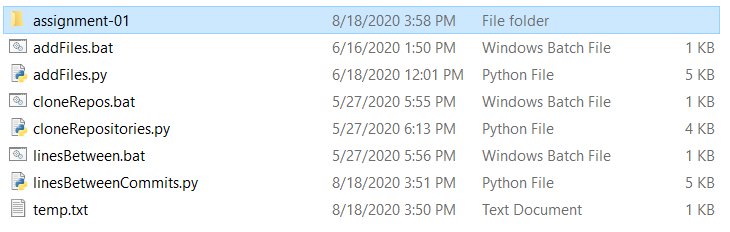

&nbsp;&nbsp;&nbsp;&nbsp;&nbsp;The next script is meant to help you grade PSS vs Homework Assignments. That script is changeCommit.py. First you input the name of the folder that the assignment is in (if you don't rename the folder it will be the same as you put in for the cloneRepositories script) and the date (in the same format). To grade activities and the PSS, you'll need to input the time and date after the end of class (adding a 10 minute grace period wouldn't be a bad idea). So if class ended at 1:55pm on 8/24/2020, enter in 2020-08-24 and 14:05 for the date/time. **When in doubt, ask the instructor what grace period they'd like to add, if any.** This will change the head/commit to be the most recent after class. The second time you run this script, you'll be inputting the time right before the next class, in order to grade the assignment itself **not the PSS and activities**. So say the next class was on 8/26/2020 at noon, you'd input 2020-08-26 and 12:00 for the date/time. This will again change the head/commit of the repository to the proper commit for grading the homework.

&nbsp;&nbsp;&nbsp;&nbsp;&nbsp;The next script we got here is a QOL script for your grading pleasure. Right now when you clone the repositories, they have the students Github usernames, which isn't fun. Makes grading difficult. Well, I have a solution for you! Use the next script in line, renameRepos! 

&nbsp;&nbsp;&nbsp;&nbsp;&nbsp;In order to use this script you do need to get one thing from Github Classroom, and that's the classlist. Let's figure out how to get those now. First up, open up Github classroom and (assuming your instructor has added you) you'll see something like this.

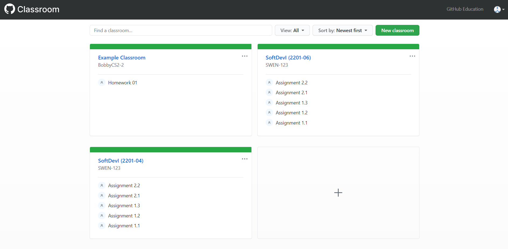

&nbsp;&nbsp;&nbsp;&nbsp;&nbsp;Once you're here you'll need to go to whatever section you're supposed to grade (for the sake of this example we'll say that I'm grading section 4).

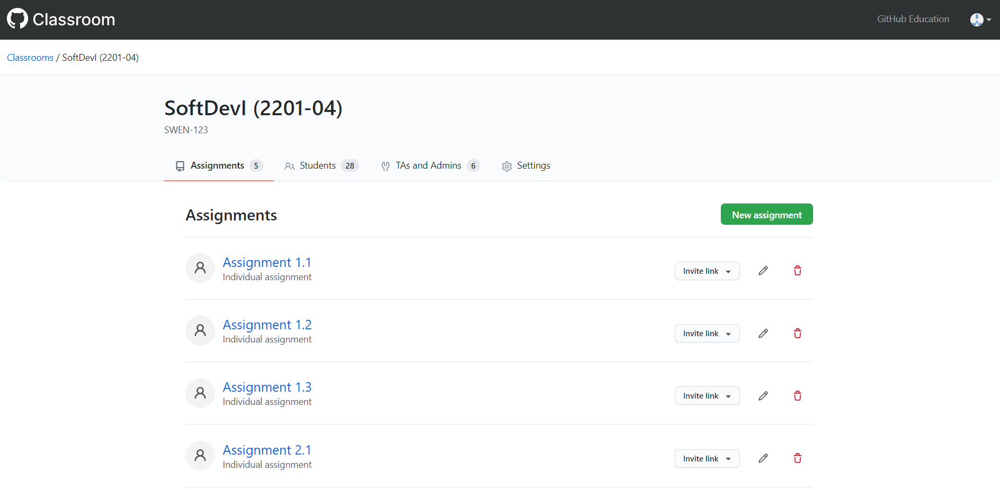

&nbsp;&nbsp;&nbsp;&nbsp;&nbsp;So this is (roughly) the screen that you see. The next thing you'll have to do is click on the 'Students' tab located in the center of the screen. From there you click the 'Download' button that's located across from the section that says 'Classroom roster'.

Next it'll ask to download without group names, click that button and it'll download

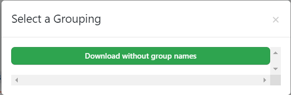

&nbsp;&nbsp;&nbsp;&nbsp;&nbsp;From there it's relatively simple. Put the classroom roster into the same directory that you have the scripts in and run the script **(assuming you have the repositories already cloned using the previous script)**. From there the script asks you for 2 things.

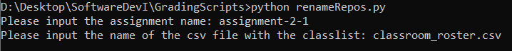

&nbsp;&nbsp;&nbsp;&nbsp;&nbsp;The first thing it asks you for is the assignment name. For this put in the same thing you did for the cloneRepositories script. If you don't remember, it should be the name of the overarching directory that houses all of the submitted assignments (ie "assignment-2-1"). The next thing is the name of the csv file. By default it is "classroom_roster.csv", however, you may change it to be whatever you want. If you choose to input nothing (just hit enter) for the name of the csv file, it will assume that the file is named "classroom_roster.csv".

&nbsp;&nbsp;&nbsp;&nbsp;&nbsp;You may be asking **"but what about the unchanged directory names?"**. Well, if a student's directory isn't linked to there name on the classlist, this script can't magically know what the name of the student is, and leaves the directory untouched. If more than a couple of directory names are unchanged, there's a chance that you're in multiple Github classroom sections, meaning the repositories from the other section have there name unchanged. If you want to change them as well, you'll have to get that classlist as well. Anywho, moving on!

The next script we’ll be going over is the addFiles script. 

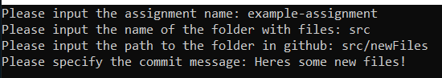

Some important notes
1. The folder with the files to be added should be in the SAME DIRECTORY as the scripts.
2. The script uses the initial directory and then uses the path you give it, so keep that in mind as well. 
3. For the sake of not pushing our luck, don’t put any double quotes (“) in the commit message.
4. There is no take-backsies that I’m aware of, so make sure you aren’t giving the students any solutions.

Those 4 things aside, just give the script what it wants and it’ll add files to the students’ repositories!

&nbsp;&nbsp;&nbsp;&nbsp;&nbsp;The final script you need to worry about (well the final one that I wrote), is linesBetweenCommits. This script is used to calculate the average number of lines added between commits. So if someone adds 1000 one commit and 1 the next, it’ll average out to 500.5. This script is meant to be used to make grading this portion of assignments a bit “easier” (possible it makes it possible). 

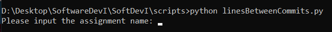

&nbsp;&nbsp;&nbsp;&nbsp;&nbsp;This one’s real easy, put in the assignment name (as it shows up in the folders, which is the same as it does in Github). However, **you must have already cloned the assignments for this one to work.**

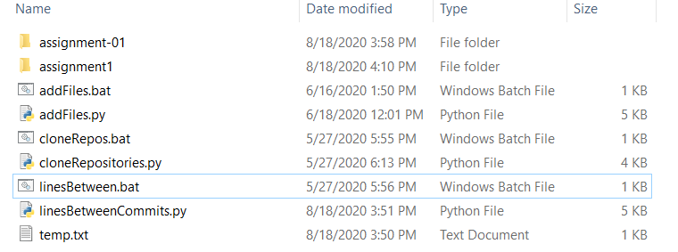

&nbsp;&nbsp;&nbsp;&nbsp;&nbsp;See those fancy little folders at the top, those are the assignments. So for the first one, you’d put “assignment-01”, but without the quotes. Once the script has been run, there will be a file in the folder with all the students’ usernames (ie aaa1234) and they’re average lines inserted per commit. 

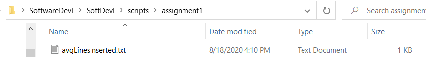

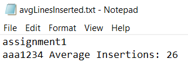

&nbsp;&nbsp;&nbsp;&nbsp;&nbsp;Congratulations! You’ve either read or skimmed through my entire guide. May your grading be easy and enjoyable thanks to these scripts! 